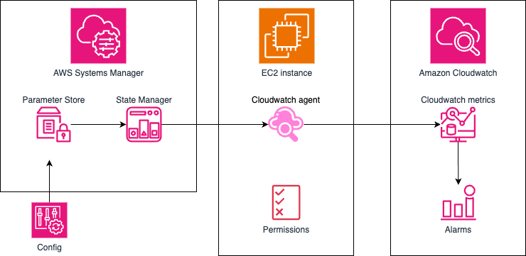

# 🚀 Trustsoft Internship - Terraform AWS Infrastructure (IT Operations)

> **This branch builds on top of the [`s3-upload-form`](https://github.com/dinhlenguyen/trustsoft-internship/tree/s3-upload-form)** - fully implemented grayscale processing web app using S3, Lambda and RDS with fuctional CI/CD pipeline. Branch also includes documentation of troubleshooting tasks from **IT Operations** team with my solutions. Files and documentation related to tasks focused on adding monitoring to current infrastructure is highlighted🔶 in the project structure below.

---
## 📦 Project Structure

```plaintext
ts-internship/
├── .github/
│   └── workflows/
│       └── terraform.yaml          # GitHub Actions CI/CD pipeline
├── assets/
│   └── trustsoft-internship-diagram.png  # Architecture diagram
├── cicd/
│   ├── app.js                      # JS for upload form
│   ├── index_a.html                # HTML for EC2 Instance A
│   └── index_b.html                # HTML for EC2 Instance B
├── infra-bootstrap/
│   └── backend_setup.tf            # Terraform remote state backend
├── lambda-grayscale/
│   ├── packaged/
│   │   ├── lambda_function.zip     # Zipped deployment package
│   │   └── layer.zip               # Lambda layer
│   ├── lambda_function.py          # Python script for grayscale conversion
│   └── requirements.txt            # Python dependencies
│
├── .gitignore
├── alb.tf                          # Application Load Balancer config
├── 🔶cloudwatch_alarm.tf           # CloudWatch alarms for EC2
├── 🔶config_rules.tf               # Config rules for required tags
├── ec2.tf                          # EC2 instances and setup
├── 🔶iam_ssm.tf                    # IAM roles and policies for EC2 and Lambda, SSM agent setup
├── lambda_image.tf                 # Lambda + permissions + trigger
├── outputs.tf                      # Terraform outputs
├── providers.tf                    # Provider & backend config
├── rds.tf                          # RDS MySQL instance
├── README.md
├── s3_cicd.tf                      # S3 bucket for HTML CI/CD
├── 🔶sns_ec2_check.tf              # SNS notifications for EC2 status checks
├── upload_form.tf                  # Upload form integration
├── variables.tf                    # Input variables
├── 🔶vpc_flowlogs.tf               # VPC Flow Logs configuration
└── vpc_sg.tf                       # VPC, subnets, routing, SGs
```
---

## ⚙️ How to Deploy
#### 1. Clone the repository
```plaintext
git clone https://github.com/dinhlenguyen/trustsoft-internship.git
cd trustsoft-internship
```
#### 2. Checkout to itops
```plaintext
git checkout itops
```
#### 3. Initialize Terraform
```plaintext
terraform init
```
#### 4. Plan the infrastructure
```plaintext
terraform plan
```
#### 5. Apply the configuration
```plaintext
terraform apply
```
Confirm `yes` when prompted.
#### 6. Configure GitHub Secrets 
Set the following secrets in your GitHub repository settings under Settings > Secrets and Variables > Actions:
```plaintext
AWS_ACCESS_KEY_ID
AWS_SECRET_ACCESS_KEY
AWS_SESSION_TOKEN (only if using temporary credentials)
DB_PASSWORD
```
#### 7. Update Cognito Identity Pool ID and RDS endpoint
After `terraform apply` use the displayed outputs to update:
- Cognito Identity Pool ID in **app.js (line 4)**  
- RDS endpoin in **lambda_image.tf (line 146)**
#### 8. (Optional) Update the lambda function resource
If you need to force an update to the Lambda function:
```plaintext
terraform taint aws_lambda_function.grayscale_image_processor
terraform apply
```
#### 9. Start CI/CD pipeline to update the front-end and Cognito ID
GitHub actions workflow is triggered by pushing new code into this branch:
```bash
git add cicd/app.js
git commit -m "Update Incognito Identity Pool ID"
git push origin itops
```
#### 10. Create RDS database table
When the RDS database is created for the first time, you need to manually create the **uploads** table.
1. Start a session with EC2 using SSM (e.g. via AWS Console)
2. run `mysql -h your-rds-endpoint -u admin -p grayscaledb`, your `your-rds-endpoint` is one of the outputs
3. enter `db_password` when prompted
4. create the uploads table:
```sql
CREATE TABLE uploads (
  id INT AUTO_INCREMENT PRIMARY KEY,
  name VARCHAR(100),
  surname VARCHAR(100),
  original_url TEXT,
  grayscale_url TEXT,
  created TIMESTAMP DEFAULT CURRENT_TIMESTAMP
);
```

#### 11. Load the application in the browser
To access the web application, use URL of **Application Load Balancer (ALB)**, which can be found in th Terraform outputs.
Example URL:
```plaintext
http://alb-internship-dinh-1842105499.eu-west-1.elb.amazonaws.com/
```

---

## 🌐 What Gets Created
- **CI/CD Pipeline**:
  - Terraform provisioning (`init` → `fmt` → `validate` → `plan` → `apply`)
  - Deployment of HTML, JS files to EC2 via SSM

- **VPC & Networking**:
  - VPC with public/private subnets across two Availability Zones
  - Internet Gateway (for public access) and NAT Gateway (for secure EC2 updates)

- **Security Groups**:
  - ALB allows HTTP from the internet
  - EC2 instances accept HTTP only from the ALB
  - Lambda has access to RDS via security group rules

- **Application Load Balancer (ALB)**:
  - Routes user traffic to EC2 instances in private subnets

- **EC2 Instances** (Private Subnets):
  - Nginx servers hosting a UI with an upload form
  - Connected to a serverless backend via S3-triggered Lambda

- **Amazon Cognito Identity Pool**:
  - Enables unauthenticated user access to upload images to S3 securely
  - Federated identity integrated into the frontend JS for direct S3 uploads

- **S3 Buckets**:
  - One for storing uploaded original images
  - One for storing transformed grayscale images
  - One for storing CICD HTML artifacts

- **Remote Terraform State**:
  - Stored securely in encrypted S3 with versioning
  - Uses DynamoDB table for state locking and consistency

- **Lambda Function**:
  - Triggered on S3 `put` event
  - Converts the image to grayscale
  - Uploads the grayscale version to S3
  - Writes metadata (name, surname, S3 URLs) to RDS

- **RDS (MySQL)**:
  - Stores metadata about uploaded images (name, surname, original image URL, grayscale image URL)

- **🔶VPC Flow Logs**:
  - Monitors and logs network traffic within the VPC.
  - Captures all traffic (accepted, rejected, and all types) for analysis.
  - Retention in days was set to 3 days
  - Logs are stored in a CloudWatch Log Group
  - Configured with an IAM Role with appropriate CloudWatch permissions.
  > Be aware that once **log group** is created, it won't be deleted via terraform destroy. For more information[`here`](https://github.com/hashicorp/terraform-provider-aws/issues/29247).

- **🔶Config Rule - Required Tags**:
  - Enforces a tagging policy for EC2 instances using AWS Config.
  - The rule ensures that all EC2 instances have the following required tags:
    - **Name**: Descriptive name for the instance.
    - **Environment**: Specifies the environment (e.g., Dev, Test, Prod).
  - Automatically evaluates compliance for each EC2 instance in the VPC.
  - Non-compliant instances are flagged in AWS Config.

- **CloudWatch Monitoring**:
  - CPU alarms for both EC2 instances with SNS email notifications
  
- **🔶SNS EC2 Status Check Alerts**:
  - Monitors the status of both EC2 instances
  - Sends notifications to a configured email address (`lend03@vse.cz`) via SNS if a status check fails.
  - CloudWatch Alarms:
    - **EC2-A-Status-Check-Failed**: Triggered if Instance A fails a status check.
    - **EC2-B-Status-Check-Failed**: Triggered if Instance B fails a status check.

- **🔶CloudWatch Agent Setup via SSM**:
  - Automated installation and configuration of CloudWatch Agent using SSM Documents.
  - Two SSM Documents:
    - **Install CloudWatch Agent**: Installs and configures CloudWatch Agent using a predefined SSM Parameter for configuration.
    - **Update CloudWatch Agent**: Updates CloudWatch Agent to the latest version.
  - CloudWatch Agent is configured to monitor:
    - **Memory Usage (% Used)**
    - **Disk Usage (% Used)**
  - Configuration is stored in **SSM Parameter Store** for easy management.
  - Associated with EC2 instances (Instance A and Instance B) using SSM Associations.
  - Automatically fetches the latest configuration from SSM Parameter Store.
  - For these metrics SNS notification via email was set up with threshold of 90%

<p align="center">
  
</p>

---

## 🔄 CI/CD Pipeline

The GitHub Actions workflow (`.github/workflows/terraform.yaml`) automates both infrastructure and front-end updates on pushes to the `cicd` branch:

1. **Trigger**  
   - Runs automatically whenever you push to the `cicd` branch.

2. **Terraform Lifecycle**  
   - `terraform init`  
   - `terraform fmt`  
   - `terraform validate`  
   - `terraform plan`  
   - `terraform apply` (provisions or updates your VPC, EC2s, ALB, S3 backend, etc.)

3. **Upload HTML Artifacts**  
   - Pushes `cicd/index_a.html`, `cicd/index_b.html` and `cicd/app.js` to the S3 bucket `s3-cicd-internship-dinh`.

4. **Deploy to EC2 via SSM**  
   - **Instance A** (`tag:Name=ec2_web_a_internship_dinh`):  
     - Downloads `index_a.html` and `app.js` from S3  
     - Overwrites `/usr/share/nginx/html/index.html` and `/usr/share/nginx/html/app.js`
     - Restarts the Nginx service  
   - **Instance B** (`tag:Name=ec2_web_b_internship_dinh`):  
     - Downloads `index_b.html` and `app.js` from S3  
     - Overwrites `/usr/share/nginx/html/index.html` and `/usr/share/nginx/html/app.js`
     - Restarts the Nginx service  

**Note:** Ensure AWS credentials are configured as GitHub Secrets (`AWS_ACCESS_KEY_ID`, `AWS_SECRET_ACCESS_KEY`, and optionally `AWS_SESSION_TOKEN` and `DB_PASSWORD`) so the workflow can authenticate and perform AWS operations.  

<p align="center">
  
</p>

---

## 🧩 System Architecture

### 🔷 High-Level Architecture

<p align="center">
  
</p>

This diagram shows the main components and data flow in the grayscale image processing application:

- **User** accesses the application through a browser and uploads an image via the EC2 web interface behind an **Application Load Balancer (ALB)**
- **Amazon Cognito** is used for identity and credential management, providing temporary credentials for uploading to S3
- The uploaded image is saved to an **S3 bucket** `s3-upload-form-internship-dinh`
- An **AWS Lambda function** is automatically triggered upon upload, which:
  - Downloads the original image
  - Converts it to grayscale using Pillow
  - Uploads the processed image to another S3 bucket `s3-lambda-internship-dinh`
  - Stores metadata (name, surname, original image URL, grayscale image URL) in an **RDS MySQL** database

### 🔄 Sequence of Operations

<p align="center">
  
</p>

The sequence diagram illustrates the interaction between services:

1. The **user** uploads an image through a form.
2. The **EC2 instance** handles the HTTP request and uploads the image to the **original S3 bucket**.
3. This triggers the **Lambda function**, which:
   - Downloads the uploaded image
   - Converts it to grayscale
   - Uploads the new image to the **grayscale S3 bucket**
   - Inserts metadata (name, surname, URLs) into the **RDS database**
4. The EC2 instance polls or waits, then fetches and displays the processed image to the user.

---

## 🔐 Accessing the RDS Database

To securely access the RDS MySQL database, you must use **AWS Systems Manager (SSM)** to tunnel into the private EC2 environment.

### Security considerations
- RDS **allows** inbound MySQL traffic (port 3306) from EC2's security group
- EC2 instances **don't allow** SSH connection (port 22), use SSM to connect 

### Instructions

1. Start a session with EC2 using SSM (e.g. via AWS Console)
2. run `mysql -h your-rds-endpoint -u admin -p grayscaledb`, your `your-rds-endpoint` is one of the outputs
3. enter `db_password` when prompted
4. run `SELECT * FROM uploads;` to query 

---

## 🖼️ Example Output

Below is an example of a successfully uploaded and processed grayscale image. The user enters their name, selects an image, and submits it. The image is converted to grayscale by a Lambda function and displayed directly on the page.

<p align="center">
  
</p>

Once the image is processed, its metadata (name, surname, original image URL, and grayscale image URL) is saved into an RDS MySQL database:

<p align="center">
  
</p>

---

## 1️⃣ Task 1 - CPU Usage Troubleshooting Guide

### Problem

The customer reported **high CPU usage** on the server. Identify the source of high CPU usage and eliminate the cause.

## Step-by-Step Solution

### 1. Identify High CPU Usage Process

Use `top` to identify which process is consuming high CPU:

```bash
top
```

Note the PID of the high CPU usage process. In this case, it was the `yes` command.

Kill the process:

```bash
sudo kill -9 <PID>
```

If the process restarts, proceed to the next step.

### 2. Investigate the Restarted Process

Check the parent and details of the new `yes` process:

```bash
ps -o pid,ppid,user,cmd -p $(pgrep yes)
```

Example output:

```
PID    PPID USER     CMD
48155  48154 root     yes
```

Get more information about the parent process:

```bash
ps -fp 48154
```

Example output:

```
UID          PID    PPID  C STIME TTY          TIME CMD
root       48154       1  0 07:19 ?        00:00:00 /bin/bash /usr/local/bin/systemd-helper
```

**Observation**: Parent PID is `1` (init), indicating the process is launched by **systemd** at boot.

### 3. Examine the Script

Check what the `systemd-helper` script is doing:

```bash
sudo cat /usr/local/bin/systemd-helper
```

Output:

```bash
#!/bin/bash
while true; do
  yes > /dev/null &
  sleep 1
done
```

This script forks a new `yes` process every second — causing high CPU load.

### 4. Locate and Stop the Service

Find the corresponding systemd unit:

```bash
grep -rl 'systemd-helper' /etc/systemd/system/
```

Stop and disable the service:

```bash
sudo systemctl stop systemd-helper.service
sudo systemctl disable systemd-helper.service
```

Find any timers or services that can restard the process:
```bash
systemctl list-timers --all
```
Example output:
```bash
Tue 2025-05-06 09:10:00 UTC 2min 36s left Tue 2025-05-06 09:00:11 UTC 7min ago sysstat-collect.timer            sysstat-collect.service
Tue 2025-05-06 10:00:00 UTC 52min left    Tue 2025-05-06 09:00:11 UTC 7min ago health-check.timer               health-check.service
```

Inspect the script:
```bash
cat /usr/local/bin/health-check
```

Also stop any related timers or services (if applicable):

```bash
sudo systemctl stop health-check.timer
sudo systemctl disable health-check.timer

sudo systemctl stop health-check.service
sudo systemctl disable health-check.service
```

### 5. Clean Up

Remove the malicious or misbehaving script and service definition:

```bash
sudo rm /usr/local/bin/systemd-helper
sudo rm /etc/systemd/system/systemd-helper.service

sudo rm -f /etc/systemd/system/health-check.timer
sudo rm -f /etc/systemd/system/health-check.service
sudo rm -f /usr/local/bin/health-check
```

Reload systemd to apply the changes:

```bash
sudo systemctl daemon-reload
```

## ✅ Resolution

The high CPU usage was caused by a systemd service continuously launching `yes > /dev/null` in an infinite loop. The issue was resolved by stopping and disabling the service, deleting the associated script and unit file, and reloading systemd.

---

## 2️⃣ Task 2 - EC2 Application & Connectivity Issue

### Problem

A customer reported that their application was not running on an EC2 instance and they were unable to connect to it via **AWS Systems Manager (SSM)**.


### Issue Investigation & Diagnosis

1. **Initial Check:**
   - Verified that the EC2 instance was not reachable through **SSM Session Manager**.

2. **System Log Review:**
   - Checked **system logs** from the EC2 instance console.
   - Observed an error related to boot failure due to a misconfigured `/etc/fstab` file.

3. **Identified Cause:**
   - The `fstab` file had incorrect or duplicate mount entries, leading to boot failure:

     ```bash
     UUID=b1e84820-06b0-4d3b-9b5d-edd836bd5895 / xfs defaults,noatime 1 1
     UUID=b1e84820-06b0-4d3b-9b5d-edd836bd5895 /var xfs defaults,noatime 1 1
     UUID=DED7-C018 /boot/efi vfat defaults,noatime,uid=0,gid=0,umask=0077,shortname=winnt,x-systemd.automount 0 2
     UUID=11111111-2222-3333-4444-555555555555 /mnt/kaput xfs defaults 0 2
     ```

### Fix Procedure

1. **Create Rescue Environment:**
   - Launched a new EC2 instance in the **same private subnet**.
   - Stopped the original broken EC2 instance.

2. **Detach & Attach Volume:**
   - Detached the **root volume** from the broken EC2.
   - Attached it to the **rescue instance** as a secondary volume (e.g., `/dev/xvdf`).

3. **Mount & Fix `fstab`:**
   - Connected to the rescue instance via **Session Manager**.
   - Mounted the attached volume:

     ```bash
     sudo mkdir /mnt/rescue
     sudo mount /dev/xvdf1 /mnt/rescue
     ```

   - Edited the `fstab` file:

     ```bash
     sudo nano /mnt/rescue/etc/fstab
     ```

   - **Fixed content** by removing problematic lines:
     - Deleted the `/var` duplicate mount.
     - Deleted the `/mnt/kaput` mount with a fake UUID.
     - Saved and closed the file.

4. **Reattach & Restore:**
   - Unmounted and detached the volume from the rescue instance.
   - Reattached the volume as the **root volume** on the original EC2 instance.

### Workaround fix
In this specific case of having a simple web application, we could use `terraform taint` command on broken EC2 instance and let `terraform apply` destroy and recreate the instance.
> For learning purposes this was not an option. 

### Notes
- For initial troubleshoot we can utilize AWS SAW (Support Automation Workflows) and use **AWSSupport-TroubleshootManagedInstance**. Reviewing the outputs might give an idea on the cause of the problem.

### ✅ Resolution

- Booted the original EC2 instance.
- The instance successfully registered with SSM.
- Application became reachable and operational.
- Health checks passed.

---

## ✨ Author
- **Name:** Dinh Le Nguyen
- **Project:** Trustsoft Internship
- **Contact:** dnhlenguyen@gmail.com

---

## Requirements

| Name | Version |
|------|---------|
| <a name="requirement_terraform"></a> [terraform](#requirement\_terraform) | >= 1.3.0 |
| <a name="requirement_aws"></a> [aws](#requirement\_aws) | ~> 5.45 |

## Providers

| Name | Version |
|------|---------|
| <a name="provider_archive"></a> [archive](#provider\_archive) | 2.7.0 |
| <a name="provider_aws"></a> [aws](#provider\_aws) | 5.96.0 |

## Modules

No modules.

## Resources

| Name | Type |
|------|------|
| [aws_cloudwatch_log_group.log_group](https://registry.terraform.io/providers/hashicorp/aws/latest/docs/resources/cloudwatch_log_group) | resource |
| [aws_cloudwatch_metric_alarm.ec2_a_cpu_high_internship_dinh](https://registry.terraform.io/providers/hashicorp/aws/latest/docs/resources/cloudwatch_metric_alarm) | resource |
| [aws_cloudwatch_metric_alarm.ec2_a_disk_high](https://registry.terraform.io/providers/hashicorp/aws/latest/docs/resources/cloudwatch_metric_alarm) | resource |
| [aws_cloudwatch_metric_alarm.ec2_a_memory_high](https://registry.terraform.io/providers/hashicorp/aws/latest/docs/resources/cloudwatch_metric_alarm) | resource |
| [aws_cloudwatch_metric_alarm.ec2_a_status_check_alarm](https://registry.terraform.io/providers/hashicorp/aws/latest/docs/resources/cloudwatch_metric_alarm) | resource |
| [aws_cloudwatch_metric_alarm.ec2_b_cpu_high_internship_dinh](https://registry.terraform.io/providers/hashicorp/aws/latest/docs/resources/cloudwatch_metric_alarm) | resource |
| [aws_cloudwatch_metric_alarm.ec2_b_disk_high](https://registry.terraform.io/providers/hashicorp/aws/latest/docs/resources/cloudwatch_metric_alarm) | resource |
| [aws_cloudwatch_metric_alarm.ec2_b_memory_high](https://registry.terraform.io/providers/hashicorp/aws/latest/docs/resources/cloudwatch_metric_alarm) | resource |
| [aws_cloudwatch_metric_alarm.ec2_b_status_check_alarm](https://registry.terraform.io/providers/hashicorp/aws/latest/docs/resources/cloudwatch_metric_alarm) | resource |
| [aws_cognito_identity_pool.cognito_internship_dinh](https://registry.terraform.io/providers/hashicorp/aws/latest/docs/resources/cognito_identity_pool) | resource |
| [aws_cognito_identity_pool_roles_attachment.guest_roles](https://registry.terraform.io/providers/hashicorp/aws/latest/docs/resources/cognito_identity_pool_roles_attachment) | resource |
| [aws_config_config_rule.required_tags](https://registry.terraform.io/providers/hashicorp/aws/latest/docs/resources/config_config_rule) | resource |
| [aws_db_instance.mysql](https://registry.terraform.io/providers/hashicorp/aws/latest/docs/resources/db_instance) | resource |
| [aws_db_subnet_group.rds_subnet_group](https://registry.terraform.io/providers/hashicorp/aws/latest/docs/resources/db_subnet_group) | resource |
| [aws_eip.nat_eip](https://registry.terraform.io/providers/hashicorp/aws/latest/docs/resources/eip) | resource |
| [aws_flow_log.vpc_flow_logs](https://registry.terraform.io/providers/hashicorp/aws/latest/docs/resources/flow_log) | resource |
| [aws_iam_instance_profile.ssm_profile_internship_dinh](https://registry.terraform.io/providers/hashicorp/aws/latest/docs/resources/iam_instance_profile) | resource |
| [aws_iam_policy.flow_log_policy](https://registry.terraform.io/providers/hashicorp/aws/latest/docs/resources/iam_policy) | resource |
| [aws_iam_policy.s3_upload_internship_dinh](https://registry.terraform.io/providers/hashicorp/aws/latest/docs/resources/iam_policy) | resource |
| [aws_iam_role.flow_log_role](https://registry.terraform.io/providers/hashicorp/aws/latest/docs/resources/iam_role) | resource |
| [aws_iam_role.iam_cognito_internship_dinh](https://registry.terraform.io/providers/hashicorp/aws/latest/docs/resources/iam_role) | resource |
| [aws_iam_role.lambda_image_role](https://registry.terraform.io/providers/hashicorp/aws/latest/docs/resources/iam_role) | resource |
| [aws_iam_role.ssm_s3_internship_dinh](https://registry.terraform.io/providers/hashicorp/aws/latest/docs/resources/iam_role) | resource |
| [aws_iam_role_policy.lambda_image_policy](https://registry.terraform.io/providers/hashicorp/aws/latest/docs/resources/iam_role_policy) | resource |
| [aws_iam_role_policy_attachment.cloudwatch_agent_attach](https://registry.terraform.io/providers/hashicorp/aws/latest/docs/resources/iam_role_policy_attachment) | resource |
| [aws_iam_role_policy_attachment.cognito_s3_internship_dinh](https://registry.terraform.io/providers/hashicorp/aws/latest/docs/resources/iam_role_policy_attachment) | resource |
| [aws_iam_role_policy_attachment.flow_log_policy_attachment](https://registry.terraform.io/providers/hashicorp/aws/latest/docs/resources/iam_role_policy_attachment) | resource |
| [aws_iam_role_policy_attachment.ssm_attach_internship_dinh](https://registry.terraform.io/providers/hashicorp/aws/latest/docs/resources/iam_role_policy_attachment) | resource |
| [aws_iam_role_policy_attachment.ssm_s3_full_access](https://registry.terraform.io/providers/hashicorp/aws/latest/docs/resources/iam_role_policy_attachment) | resource |
| [aws_instance.web_a_internship_dinh](https://registry.terraform.io/providers/hashicorp/aws/latest/docs/resources/instance) | resource |
| [aws_instance.web_b_internship_dinh](https://registry.terraform.io/providers/hashicorp/aws/latest/docs/resources/instance) | resource |
| [aws_internet_gateway.igw_internship_dinh](https://registry.terraform.io/providers/hashicorp/aws/latest/docs/resources/internet_gateway) | resource |
| [aws_lambda_function.grayscale_image_processor](https://registry.terraform.io/providers/hashicorp/aws/latest/docs/resources/lambda_function) | resource |
| [aws_lambda_layer_version.pillow_layer](https://registry.terraform.io/providers/hashicorp/aws/latest/docs/resources/lambda_layer_version) | resource |
| [aws_lambda_permission.allow_s3_trigger](https://registry.terraform.io/providers/hashicorp/aws/latest/docs/resources/lambda_permission) | resource |
| [aws_lb.alb_internship_dinh](https://registry.terraform.io/providers/hashicorp/aws/latest/docs/resources/lb) | resource |
| [aws_lb_listener.alb_listener_http](https://registry.terraform.io/providers/hashicorp/aws/latest/docs/resources/lb_listener) | resource |
| [aws_lb_target_group.tg_internship_dinh](https://registry.terraform.io/providers/hashicorp/aws/latest/docs/resources/lb_target_group) | resource |
| [aws_lb_target_group_attachment.tg_attachment_a](https://registry.terraform.io/providers/hashicorp/aws/latest/docs/resources/lb_target_group_attachment) | resource |
| [aws_lb_target_group_attachment.tg_attachment_b](https://registry.terraform.io/providers/hashicorp/aws/latest/docs/resources/lb_target_group_attachment) | resource |
| [aws_nat_gateway.nat_internship_dinh](https://registry.terraform.io/providers/hashicorp/aws/latest/docs/resources/nat_gateway) | resource |
| [aws_route.private_rt_default_route](https://registry.terraform.io/providers/hashicorp/aws/latest/docs/resources/route) | resource |
| [aws_route.public_rt_default_route](https://registry.terraform.io/providers/hashicorp/aws/latest/docs/resources/route) | resource |
| [aws_route_table.private_rt](https://registry.terraform.io/providers/hashicorp/aws/latest/docs/resources/route_table) | resource |
| [aws_route_table.public_rt](https://registry.terraform.io/providers/hashicorp/aws/latest/docs/resources/route_table) | resource |
| [aws_route_table_association.private_a](https://registry.terraform.io/providers/hashicorp/aws/latest/docs/resources/route_table_association) | resource |
| [aws_route_table_association.private_b](https://registry.terraform.io/providers/hashicorp/aws/latest/docs/resources/route_table_association) | resource |
| [aws_route_table_association.public_a](https://registry.terraform.io/providers/hashicorp/aws/latest/docs/resources/route_table_association) | resource |
| [aws_route_table_association.public_b](https://registry.terraform.io/providers/hashicorp/aws/latest/docs/resources/route_table_association) | resource |
| [aws_s3_bucket.cicd_website](https://registry.terraform.io/providers/hashicorp/aws/latest/docs/resources/s3_bucket) | resource |
| [aws_s3_bucket.transformed_images](https://registry.terraform.io/providers/hashicorp/aws/latest/docs/resources/s3_bucket) | resource |
| [aws_s3_bucket.upload_form](https://registry.terraform.io/providers/hashicorp/aws/latest/docs/resources/s3_bucket) | resource |
| [aws_s3_bucket_cors_configuration.upload_cors](https://registry.terraform.io/providers/hashicorp/aws/latest/docs/resources/s3_bucket_cors_configuration) | resource |
| [aws_s3_bucket_notification.trigger_on_upload](https://registry.terraform.io/providers/hashicorp/aws/latest/docs/resources/s3_bucket_notification) | resource |
| [aws_s3_bucket_policy.allow_public_read](https://registry.terraform.io/providers/hashicorp/aws/latest/docs/resources/s3_bucket_policy) | resource |
| [aws_s3_bucket_public_access_block.transformed_block](https://registry.terraform.io/providers/hashicorp/aws/latest/docs/resources/s3_bucket_public_access_block) | resource |
| [aws_s3_bucket_public_access_block.uploads_block](https://registry.terraform.io/providers/hashicorp/aws/latest/docs/resources/s3_bucket_public_access_block) | resource |
| [aws_s3_bucket_versioning.terraform_state_versioning](https://registry.terraform.io/providers/hashicorp/aws/latest/docs/resources/s3_bucket_versioning) | resource |
| [aws_s3_bucket_versioning.upload_versioning](https://registry.terraform.io/providers/hashicorp/aws/latest/docs/resources/s3_bucket_versioning) | resource |
| [aws_security_group.alb_internship_dinh](https://registry.terraform.io/providers/hashicorp/aws/latest/docs/resources/security_group) | resource |
| [aws_security_group.lambda_internship_dinh](https://registry.terraform.io/providers/hashicorp/aws/latest/docs/resources/security_group) | resource |
| [aws_security_group.rds_sg](https://registry.terraform.io/providers/hashicorp/aws/latest/docs/resources/security_group) | resource |
| [aws_security_group.web_internship_dinh](https://registry.terraform.io/providers/hashicorp/aws/latest/docs/resources/security_group) | resource |
| [aws_sns_topic.alarms_internship_dinh](https://registry.terraform.io/providers/hashicorp/aws/latest/docs/resources/sns_topic) | resource |
| [aws_sns_topic.ec2_status_topic](https://registry.terraform.io/providers/hashicorp/aws/latest/docs/resources/sns_topic) | resource |
| [aws_sns_topic_subscription.email_alert](https://registry.terraform.io/providers/hashicorp/aws/latest/docs/resources/sns_topic_subscription) | resource |
| [aws_sns_topic_subscription.email_internship_dinh](https://registry.terraform.io/providers/hashicorp/aws/latest/docs/resources/sns_topic_subscription) | resource |
| [aws_ssm_association.manage_cloudwatch_agent_a](https://registry.terraform.io/providers/hashicorp/aws/latest/docs/resources/ssm_association) | resource |
| [aws_ssm_association.manage_cloudwatch_agent_b](https://registry.terraform.io/providers/hashicorp/aws/latest/docs/resources/ssm_association) | resource |
| [aws_ssm_association.update_cloudwatch_agent_a](https://registry.terraform.io/providers/hashicorp/aws/latest/docs/resources/ssm_association) | resource |
| [aws_ssm_association.update_cloudwatch_agent_b](https://registry.terraform.io/providers/hashicorp/aws/latest/docs/resources/ssm_association) | resource |
| [aws_ssm_document.cw_agent_install](https://registry.terraform.io/providers/hashicorp/aws/latest/docs/resources/ssm_document) | resource |
| [aws_ssm_document.cw_agent_update](https://registry.terraform.io/providers/hashicorp/aws/latest/docs/resources/ssm_document) | resource |
| [aws_ssm_parameter.cw_agent_config](https://registry.terraform.io/providers/hashicorp/aws/latest/docs/resources/ssm_parameter) | resource |
| [aws_subnet.private_subnet_a](https://registry.terraform.io/providers/hashicorp/aws/latest/docs/resources/subnet) | resource |
| [aws_subnet.private_subnet_b](https://registry.terraform.io/providers/hashicorp/aws/latest/docs/resources/subnet) | resource |
| [aws_subnet.public_subnet_a](https://registry.terraform.io/providers/hashicorp/aws/latest/docs/resources/subnet) | resource |
| [aws_subnet.public_subnet_b](https://registry.terraform.io/providers/hashicorp/aws/latest/docs/resources/subnet) | resource |
| [aws_vpc.vpc_internship_dinh](https://registry.terraform.io/providers/hashicorp/aws/latest/docs/resources/vpc) | resource |
| [archive_file.function_package](https://registry.terraform.io/providers/hashicorp/archive/latest/docs/data-sources/file) | data source |
| [aws_iam_policy_document.unauth_assume_role](https://registry.terraform.io/providers/hashicorp/aws/latest/docs/data-sources/iam_policy_document) | data source |
| [aws_iam_policy_document.upload_to_s3](https://registry.terraform.io/providers/hashicorp/aws/latest/docs/data-sources/iam_policy_document) | data source |

## Inputs

| Name | Description | Type | Default | Required |
|------|-------------|------|---------|:--------:|
| <a name="input_ami_id"></a> [ami\_id](#input\_ami\_id) | AMI ID for EC2 instances | `string` | `"ami-0ce8c2b29fcc8a346"` | no |
| <a name="input_availability_zone_a"></a> [availability\_zone\_a](#input\_availability\_zone\_a) | Availability Zone for Subnet A | `string` | `"eu-west-1a"` | no |
| <a name="input_availability_zone_b"></a> [availability\_zone\_b](#input\_availability\_zone\_b) | Availability Zone for Subnet B | `string` | `"eu-west-1b"` | no |
| <a name="input_aws_region"></a> [aws\_region](#input\_aws\_region) | AWS Region to deploy into | `string` | `"eu-west-1"` | no |
| <a name="input_db_password"></a> [db\_password](#input\_db\_password) |  RDS settings  | `string` | n/a | yes |
| <a name="input_instance_type"></a> [instance\_type](#input\_instance\_type) | EC2 instance type | `string` | `"t2.micro"` | no |
| <a name="input_notification_emails"></a> [notification\_emails](#input\_notification\_emails) | List of email addresses to notify for CloudWatch alarms | `list(string)` | <pre>[<br/>  "lend03@vse.cz"<br/>]</pre> | no |
| <a name="input_private_subnet_cidr_a"></a> [private\_subnet\_cidr\_a](#input\_private\_subnet\_cidr\_a) | CIDR block for Private Subnet A | `string` | `"10.0.1.0/24"` | no |
| <a name="input_private_subnet_cidr_b"></a> [private\_subnet\_cidr\_b](#input\_private\_subnet\_cidr\_b) | CIDR block for Private Subnet B | `string` | `"10.0.2.0/24"` | no |
| <a name="input_public_subnet_cidr_a"></a> [public\_subnet\_cidr\_a](#input\_public\_subnet\_cidr\_a) | CIDR block for Public Subnet A | `string` | `"10.0.101.0/24"` | no |
| <a name="input_public_subnet_cidr_b"></a> [public\_subnet\_cidr\_b](#input\_public\_subnet\_cidr\_b) | CIDR block for Public Subnet B | `string` | `"10.0.102.0/24"` | no |
| <a name="input_user_data_script"></a> [user\_data\_script](#input\_user\_data\_script) | User data script to bootstrap EC2 instances | `string` | `""` | no |
| <a name="input_user_data_script_a"></a> [user\_data\_script\_a](#input\_user\_data\_script\_a) | User data for EC2 Instance A | `string` | `"#!/bin/bash\nyum update -y\nsudo dnf install -y mariadb105\nyum install -y nginx\nsystemctl start nginx\nsystemctl enable nginx\necho \"<h1>Welcome to Server A - Internship Dinh</h1>\" > /usr/share/nginx/html/index.html\n"` | no |
| <a name="input_user_data_script_b"></a> [user\_data\_script\_b](#input\_user\_data\_script\_b) | User data for EC2 Instance B | `string` | `"#!/bin/bash\nyum update -y\nsudo dnf install -y mariadb105\nyum install -y nginx\nsystemctl start nginx\nsystemctl enable nginx\necho \"<h1>Welcome to Server B - Internship Dinh</h1>\" > /usr/share/nginx/html/index.html\n"` | no |
| <a name="input_vpc_cidr"></a> [vpc\_cidr](#input\_vpc\_cidr) | CIDR block for the VPC | `string` | `"10.0.0.0/16"` | no |

## Outputs

| Name | Description |
|------|-------------|
| <a name="output_alb_dns_name"></a> [alb\_dns\_name](#output\_alb\_dns\_name) | DNS name of the ALB |
| <a name="output_identity_pool_id"></a> [identity\_pool\_id](#output\_identity\_pool\_id) | Cognito identity ID |
| <a name="output_rds_endpoint"></a> [rds\_endpoint](#output\_rds\_endpoint) | RDS MySQL endpoint |