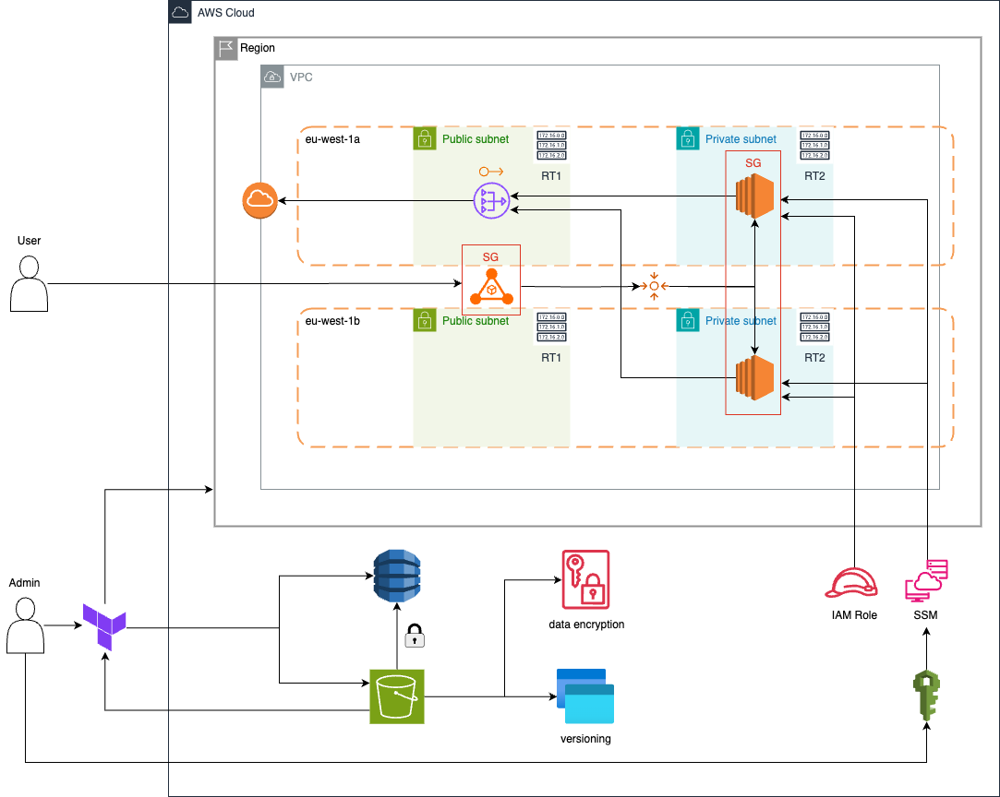

# 🚀 Trustsoft Internship - Terraform AWS Infrastructure

## 📑 Table of Contents
- [🌿 Branches Overview](#-branches-overview)
- [🖼️ Architecture Diagram](#-architecture-diagram)
- [📦 Project Structure](#-project-structure)
- [⚙️ How to Deploy](#️-how-to-deploy)
- [🌐 What Gets Created](#-what-gets-created)
- [🛡️ Security Considerations](#-security-considerations)
- [📤 Remote State Management](#-remote-state-management)
- [📊 CloudWatch Monitoring](#-cloudwatch-monitoring)
- [🖥️ EC2 Access via Systems Manager Session Manager](#-ec2-access-via-systems-manager-session-manager)
- [✨ Author](#-author)
- [📢 Notes](#-notes)

---

This project provisions a full AWS infrastructure using **Terraform**, including:
- VPC with Public and Private Subnets (across two AZs)
- Internet Gateway and NAT Gateway
- Security Groups for ALB and EC2
- Two EC2 Instances in private subnets (Nginx installed with different web pages)
- Application Load Balancer (ALB) distributing traffic to both EC2s
- Outputs for key resources

> This branch represents the main task solution from Architecture/DevOps team.

---
## 🌿 Branches overview
- [`master`](https://github.com/dinhlenguyen/trustsoft-internship/tree/master)
- [`cicd`](https://github.com/dinhlenguyen/trustsoft-internship/tree/cicd) 
- [`s3-upload-form`](https://github.com/dinhlenguyen/trustsoft-internship/tree/s3-upload-form)
- [`itops`](https://github.com/dinhlenguyen/trustsoft-internship/tree/itops) 
- [`auto-scaling-group`](https://github.com/dinhlenguyen/trustsoft-internship/tree/auto-scaling-group) 
```plaintext
├── master/                           # Main task by Architecture/DevOps team
│   ├── cicd/                         # Updated version of master branch with CI/CD pipeline for front-end
│   │   └── s3-upload-form/           # Updated version of cicd branch with S3 upload functionality and grayscale image processing
│   │       └── itops/                # Updated version of s3-upload-form with monitoring and IT Operations troubleshooting solutions
│   └── auto-scaling-group/           # Updated version of master branch with auto-scaling for EC2 instances
```
---

## 🖼️ Architecture Diagram


---

## 📦 Project Structure

```plaintext
ts-internship/
├── assets/
│   └── trustsoft-internship-diagram.png
├── infra-bootstrap/
│   └── backend_setup.tf      # Create S3 bucket and DynamoDB table for backend
│
├── providers.tf            # AWS provider configuration and Terraform settings + remote backend configuration (S3 + DynamoDB)
├── variables.tf            # Input variables for flexible configuration
├── terraform.tfvars        # Defines environment-specific variable values (email addresses)
├── outputs.tf              # Exposed resource outputs (VPC ID, Subnet IDs, ALB DNS, etc.)
├── vpc_sg.tf               # VPC, Subnets, NAT Gateway, Internet Gateway, Security Groups
├── ec2.tf                  # EC2 Instances creation with different user-data scripts
├── alb.tf                  # Application Load Balancer setup with target groups and listeners
├── iam.tf                  # IAM Role, Policy Attachment, Instance Profile for SSM
└── cloudwatch_alarm.tf     # Defines CPU utilization CloudWatch alarms for both EC2 instances
```
---

## ⚙️ How to Deploy
#### 1. Clone the repository
```plaintext
git clone https://github.com/dinhlenguyen/trustsoft-internship.git
cd trustsoft-internship
```
#### 2. Initialize Terraform
```plaintext
terraform init
```
#### 3. Plan the infrastructure
```plaintext
terraform plan
```
#### 4. Apply the configuration
```plaintext
terraform apply
```
Confirm `yes` when prompted.

---

## 🌐 What Gets Created
- **VPC** with CIDR `10.0.0.0/16`
- **Public Subnets** (`10.0.101.0/24`, `10.0.102.0/24`)
- **Private Subnets** (`10.0.1.0/24`, `10.0.2.0/24`)
- **Internet Gateway** and **Single NAT Gateway**
- **Security Groups**:
  - **ALB SG**: allows inbound HTTP (port 80) from the internet
  - **Web EC2 SG**: allows inbound HTTP (port 80) only from ALB SG
- **EC2 Instances**:
  - Private only (no public IPs)
  - Each instance serves different web content (`Server A`, `Server B`) for testing Load Balancer behavior
- **Application Load Balancer**:
  - Round-robin distribution between the two EC2 instances
- **CloudWatch Monitoring**:
  - CPU Utilization alarms for each EC2 instance with **SNS** email notifications to configured subscribers

## 🛡️ Security Considerations
- **No SSH (port 22) open** to the internet.
- **EC2 instances** are private (reachable only through Load Balancer and outbound through NAT Gateway).
- **NAT Gateway** enables safe outbound internet access (for updates, patches, etc.).

## 📤 Remote State Management

This project uses a **remote backend** to store the Terraform state securely and safely.

### State Storage
- The Terraform state file (`terraform.tfstate`) is stored in an encrypted S3 bucket.
- **Bucket name:** `s3_backend_internship_dinh`

### State Locking
- A DynamoDB table named `lockfile_internship_dinh` is used to manage state locks and prevent concurrent modifications.

### Backend Settings
- Encryption enabled using AWS KMS (SSE-KMS) with a customer-managed key.
- Versioning is enabled on the S3 bucket to allow recovery of previous state versions.

## 📊 CloudWatch Monitoring

This project includes **CloudWatch alarms** to monitor CPU usage of both EC2 instances in private subnets.

### Alarms Created:

| Alarm Name                       | Monitored Instance               | Threshold | Evaluation Periods | Description                                  |
|----------------------------------|----------------------------------|-----------|---------------------|----------------------------------------------|
| `ec2-a-cpu-high-internship-dinh` | `ec2_web_a_internship_dinh`      | > 10%     | 2 × 2 min           | Triggers if EC2-A CPU exceeds 10% for 4 min |
| `ec2-b-cpu-high-internship-dinh` | `ec2_web_b_internship_dinh`      | > 10%     | 2 × 2 min           | Triggers if EC2-B CPU exceeds 10% for 4 min |

### Alarm Details:

- **Namespace:** `AWS/EC2`
- **Metric:** `CPUUtilization`
- **Statistic:** `Average`
- **Treat missing data:** `notBreaching`
- **Notification:** SNS topic `alarms-internship-dinh` will send emails to the configured subscribers


>  These alarms are configured with a **low threshold (10%)** to help verify functionality. In production, increase the threshold as appropriate (e.g. 70%).

## 🖥️ EC2 Access via Systems Manager Session Manager

Since the EC2 instances are deployed into private subnets with no public IP and no SSH ports open, access is provided securely through **AWS Systems Manager Session Manager**.

### How to Connect

1. Go to the AWS Console → **Systems Manager → Session Manager**.
2. Click **Start Session**.
3. Select the EC2 instance you want to connect to.
4. You get secure shell access directly without needing SSH, keys, or public IPs.

---

## ✨ Author
- **Name:** Dinh Le Nguyen
- **Project:** Trustsoft Internship
- **Contact:** dnhlenguyen@gmail.com
---

## 📢 Notes

- The AMI ID (`ami_id`) must be correctly set for your region (`eu-west-1`).
- Load Balancer traffic alternates between EC2 instances (proving health checks and load balancing).
- The `.terraform.lock.hcl` file is committed for consistent provider versions.
- Terraform state is securely stored in a remote S3 bucket with DynamoDB locking.

---

## Requirements

| Name | Version |
|------|---------|
| <a name="requirement_terraform"></a> [terraform](#requirement\_terraform) | >= 1.3.0 |
| <a name="requirement_aws"></a> [aws](#requirement\_aws) | ~> 5.45 |

## Providers

| Name | Version |
|------|---------|
| <a name="provider_aws"></a> [aws](#provider\_aws) | 5.96.0 |

## Modules

No modules.

## Resources

| Name | Type |
|------|------|
| [aws_cloudwatch_metric_alarm.ec2_cpu_high_internship_dinh](https://registry.terraform.io/providers/hashicorp/aws/latest/docs/resources/cloudwatch_metric_alarm) | resource |
| [aws_eip.nat_eip](https://registry.terraform.io/providers/hashicorp/aws/latest/docs/resources/eip) | resource |
| [aws_iam_instance_profile.ssm_profile_internship_dinh](https://registry.terraform.io/providers/hashicorp/aws/latest/docs/resources/iam_instance_profile) | resource |
| [aws_iam_role.ssm_internship_dinh](https://registry.terraform.io/providers/hashicorp/aws/latest/docs/resources/iam_role) | resource |
| [aws_iam_role_policy_attachment.ssm_attach_internship_dinh](https://registry.terraform.io/providers/hashicorp/aws/latest/docs/resources/iam_role_policy_attachment) | resource |
| [aws_instance.web_instances](https://registry.terraform.io/providers/hashicorp/aws/latest/docs/resources/instance) | resource |
| [aws_internet_gateway.igw_internship_dinh](https://registry.terraform.io/providers/hashicorp/aws/latest/docs/resources/internet_gateway) | resource |
| [aws_lb.alb_internship_dinh](https://registry.terraform.io/providers/hashicorp/aws/latest/docs/resources/lb) | resource |
| [aws_lb_listener.alb_listener_http](https://registry.terraform.io/providers/hashicorp/aws/latest/docs/resources/lb_listener) | resource |
| [aws_lb_target_group.tg_internship_dinh](https://registry.terraform.io/providers/hashicorp/aws/latest/docs/resources/lb_target_group) | resource |
| [aws_lb_target_group_attachment.tg_attachments](https://registry.terraform.io/providers/hashicorp/aws/latest/docs/resources/lb_target_group_attachment) | resource |
| [aws_nat_gateway.nat_internship_dinh](https://registry.terraform.io/providers/hashicorp/aws/latest/docs/resources/nat_gateway) | resource |
| [aws_route.private_rt_default_route](https://registry.terraform.io/providers/hashicorp/aws/latest/docs/resources/route) | resource |
| [aws_route.public_rt_default_route](https://registry.terraform.io/providers/hashicorp/aws/latest/docs/resources/route) | resource |
| [aws_route_table.private_rt](https://registry.terraform.io/providers/hashicorp/aws/latest/docs/resources/route_table) | resource |
| [aws_route_table.public_rt](https://registry.terraform.io/providers/hashicorp/aws/latest/docs/resources/route_table) | resource |
| [aws_route_table_association.private_a](https://registry.terraform.io/providers/hashicorp/aws/latest/docs/resources/route_table_association) | resource |
| [aws_route_table_association.private_b](https://registry.terraform.io/providers/hashicorp/aws/latest/docs/resources/route_table_association) | resource |
| [aws_route_table_association.public_a](https://registry.terraform.io/providers/hashicorp/aws/latest/docs/resources/route_table_association) | resource |
| [aws_route_table_association.public_b](https://registry.terraform.io/providers/hashicorp/aws/latest/docs/resources/route_table_association) | resource |
| [aws_security_group.alb_internship_dinh](https://registry.terraform.io/providers/hashicorp/aws/latest/docs/resources/security_group) | resource |
| [aws_security_group.web_internship_dinh](https://registry.terraform.io/providers/hashicorp/aws/latest/docs/resources/security_group) | resource |
| [aws_sns_topic.alarms_internship_dinh](https://registry.terraform.io/providers/hashicorp/aws/latest/docs/resources/sns_topic) | resource |
| [aws_sns_topic_subscription.email_internship_dinh](https://registry.terraform.io/providers/hashicorp/aws/latest/docs/resources/sns_topic_subscription) | resource |
| [aws_subnet.private_subnet_a](https://registry.terraform.io/providers/hashicorp/aws/latest/docs/resources/subnet) | resource |
| [aws_subnet.private_subnet_b](https://registry.terraform.io/providers/hashicorp/aws/latest/docs/resources/subnet) | resource |
| [aws_subnet.public_subnet_a](https://registry.terraform.io/providers/hashicorp/aws/latest/docs/resources/subnet) | resource |
| [aws_subnet.public_subnet_b](https://registry.terraform.io/providers/hashicorp/aws/latest/docs/resources/subnet) | resource |
| [aws_vpc.vpc_internship_dinh](https://registry.terraform.io/providers/hashicorp/aws/latest/docs/resources/vpc) | resource |

## Inputs

| Name | Description | Type | Default | Required |
|------|-------------|------|---------|:--------:|
| <a name="input_ami_id"></a> [ami\_id](#input\_ami\_id) | AMI ID for EC2 instances | `string` | `"ami-0ce8c2b29fcc8a346"` | no |
| <a name="input_availability_zone_a"></a> [availability\_zone\_a](#input\_availability\_zone\_a) | Availability Zone for Subnet A | `string` | `"eu-west-1a"` | no |
| <a name="input_availability_zone_b"></a> [availability\_zone\_b](#input\_availability\_zone\_b) | Availability Zone for Subnet B | `string` | `"eu-west-1b"` | no |
| <a name="input_aws_region"></a> [aws\_region](#input\_aws\_region) | AWS Region to deploy into | `string` | `"eu-west-1"` | no |
| <a name="input_instance_type"></a> [instance\_type](#input\_instance\_type) | EC2 instance type | `string` | `"t2.micro"` | no |
| <a name="input_notification_emails"></a> [notification\_emails](#input\_notification\_emails) | List of email addresses to notify for CloudWatch alarms | `list(string)` | `[]` | no |
| <a name="input_private_subnet_cidr_a"></a> [private\_subnet\_cidr\_a](#input\_private\_subnet\_cidr\_a) | CIDR block for Private Subnet A | `string` | `"10.0.1.0/24"` | no |
| <a name="input_private_subnet_cidr_b"></a> [private\_subnet\_cidr\_b](#input\_private\_subnet\_cidr\_b) | CIDR block for Private Subnet B | `string` | `"10.0.2.0/24"` | no |
| <a name="input_public_subnet_cidr_a"></a> [public\_subnet\_cidr\_a](#input\_public\_subnet\_cidr\_a) | CIDR block for Public Subnet A | `string` | `"10.0.101.0/24"` | no |
| <a name="input_public_subnet_cidr_b"></a> [public\_subnet\_cidr\_b](#input\_public\_subnet\_cidr\_b) | CIDR block for Public Subnet B | `string` | `"10.0.102.0/24"` | no |
| <a name="input_user_data_script"></a> [user\_data\_script](#input\_user\_data\_script) | User data script for EC2 instances | `string` | `"#!/bin/bash\nyum update -y\nyum install -y nginx\nsystemctl start nginx\nsystemctl enable nginx\n\nINSTANCE_NAME=$(curl -s http://169.254.169.254/latest/meta-data/tags/instance/Name)\nif [[ \"$INSTANCE_NAME\" == \"ec2_web_a_internship_dinh\" ]]; then\n  echo \"<h1>Welcome to Server A - Internship Dinh</h1>\" > /usr/share/nginx/html/index.html\nelif [[ \"$INSTANCE_NAME\" == \"ec2_web_b_internship_dinh\" ]]; then\n  echo \"<h1>Welcome to Server B - Internship Dinh</h1>\" > /usr/share/nginx/html/index.html\nelse\n  echo \"<h1>Welcome to Unknown Server - Internship Dinh</h1>\" > /usr/share/nginx/html/index.html\nfi\n"` | no |
| <a name="input_vpc_cidr"></a> [vpc\_cidr](#input\_vpc\_cidr) | CIDR block for the VPC | `string` | `"10.0.0.0/16"` | no |

## Outputs

| Name | Description |
|------|-------------|
| <a name="output_alb_dns_name"></a> [alb\_dns\_name](#output\_alb\_dns\_name) | DNS name of the ALB |