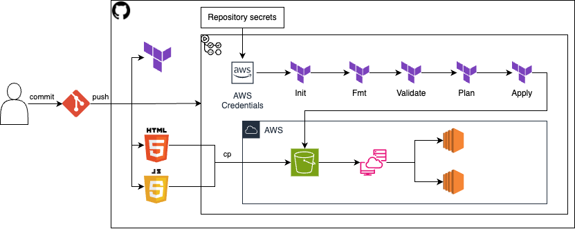
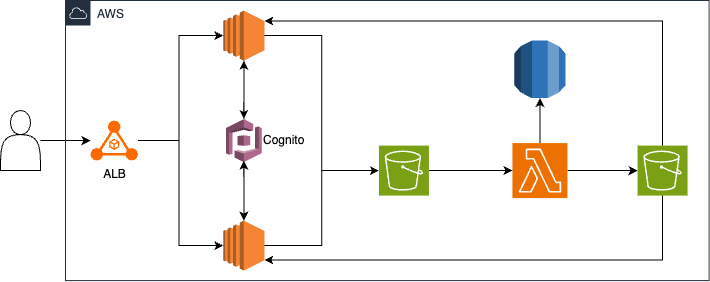
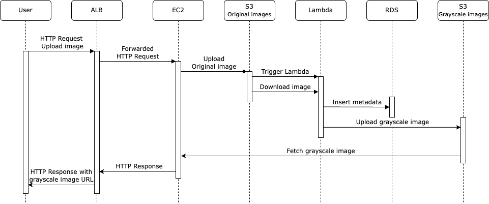
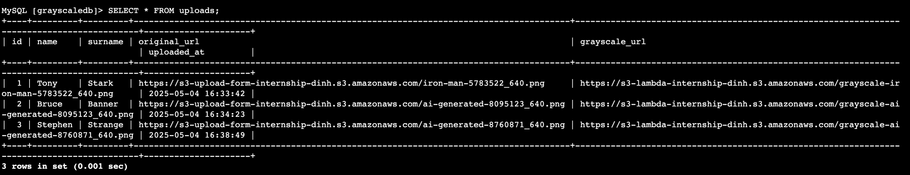

# 🚀 Trustsoft Internship - Terraform AWS Infrastructure (CI/CD + S3 Upload Pipeline)

> **This branch builds on top of the [`cicd`](https://github.com/dinhlenguyen/trustsoft-internship/tree/cicd)** (infrastructure CI/CD pipeline) and integrates an S3 upload pipeline in this branch to deliver a full-stack automated grayscale image processing workflow using S3, Lambda, and RDS. For more information about the architecture itself, please refer to the documentation in the cicd branch.

---
## 📦 Project Structure

```plaintext
ts-internship/
├── .github/
│   └── workflows/
│       └── terraform.yaml          # GitHub Actions CI/CD pipeline
├── assets/
│   └── trustsoft-internship-diagram.png  # Architecture diagram
├── cicd/
│   ├── app.js                      # JS for upload form
│   ├── index_a.html                # HTML for EC2 Instance A
│   └── index_b.html                # HTML for EC2 Instance B
├── infra-bootstrap/
│   └── backend_setup.tf            # Terraform remote state backend
├── lambda-grayscale/
│   ├── packaged/
│   │   ├── lambda_function.zip     # Zipped deployment package
│   │   └── layer.zip               # Lambda layer
│   ├── lambda_function.py          # Python script for grayscale conversion
│   └── requirements.txt            # Python dependencies
│
├── .gitignore
├── alb.tf                          # Application Load Balancer config
├── cloudwatch_alarm.tf             # CloudWatch alarms for EC2
├── ec2.tf                          # EC2 instances and setup
├── iam.tf                          # IAM roles and policies for EC2 and Lambda
├── lambda_image.tf                 # Lambda + permissions + trigger
├── outputs.tf                      # Terraform outputs
├── providers.tf                    # Provider & backend config
├── rds.tf                          # RDS MySQL instance
├── README.md
├── s3_cicd.tf                      # S3 bucket for HTML CI/CD
├── upload_form.tf                  # Upload form integration
├── variables.tf                    # Input variables
└── vpc_sg.tf                       # VPC, subnets, routing, SGs
```

> This project does not include a **terraform.tfvars** file with **db_password** defined. It is recommended to create a terraform.tfvars file locally to securely store your database password

---

## ⚙️ How to Deploy
#### 1. Clone the repository
```plaintext
git clone https://github.com/dinhlenguyen/trustsoft-internship.git
cd trustsoft-internship
```
#### 2. Checkout to s3-upload-form branch
```plaintext
git checkout s3-upload-form
```
#### 3. Initialize Terraform
```plaintext
terraform init
```
#### 4. Plan the infrastructure
```plaintext
terraform plan
```
#### 5. Apply the configuration
```plaintext
terraform apply
```
Confirm `yes` when prompted.
#### 6. Configure GitHub Secrets 
Set the following secrets in your GitHub repository settings under Settings > Secrets and Variables > Actions:
```plaintext
AWS_ACCESS_KEY_ID
AWS_SECRET_ACCESS_KEY
AWS_SESSION_TOKEN (only if using temporary credentials)
DB_PASSWORD
```
#### 7. Update Cognito Identity Pool ID and RDS endpoint
After `terraform apply` use the displayed outputs to update:
- Cognito Identity Pool ID in **app.js (line 4)**  
- RDS endpoin in **lambda_image.tf (line 146)**
#### 8. (Optional) Update the lambda function resource
If you need to force an update to the Lambda function:
```plaintext
terraform taint aws_lambda_function.grayscale_image_processor
terraform apply
```
#### 9. Start CI/CD pipeline to update the front-end and Cognito ID
GitHub actions workflow is triggered by pushing new code into this branch:
```bash
git add cicd/app.js
git commit -m "Update Incognito Identity Pool ID"
git push origin s3-upload-form
```
#### 10. Create RDS database table
When the RDS database is created for the first time, you need to manually create the **uploads** table.
1. Start a session with EC2 using SSM (e.g. via AWS Console)
2. run `mysql -h your-rds-endpoint -u admin -p grayscaledb`, your `your-rds-endpoint` is one of the outputs
3. enter `db_password` when prompted
4. create the uploads table:
```sql
CREATE TABLE uploads (
  id INT AUTO_INCREMENT PRIMARY KEY,
  name VARCHAR(100),
  surname VARCHAR(100),
  original_url TEXT,
  grayscale_url TEXT,
  created TIMESTAMP DEFAULT CURRENT_TIMESTAMP
);
```

#### 11. Load the application in the browser
To access the web application, use URL of **Application Load Balancer (ALB)**, which can be found in th Terraform outputs.
Example URL:
```plaintext
http://alb-internship-dinh-1842105499.eu-west-1.elb.amazonaws.com/
```

---
## 🌐 What Gets Created
- **CI/CD Pipeline**:
  - Terraform provisioning (`init` → `fmt` → `validate` → `plan` → `apply`)
  - Deployment of HTML, JS files to EC2 via SSM

- **VPC & Networking**:
  - VPC with public/private subnets across two Availability Zones
  - Internet Gateway (for public access) and NAT Gateway (for secure EC2 updates)

- **Security Groups**:
  - ALB allows HTTP from the internet
  - EC2 instances accept HTTP only from the ALB
  - Lambda has access to RDS via security group rules

- **Application Load Balancer (ALB)**:
  - Routes user traffic to EC2 instances in private subnets

- **EC2 Instances** (Private Subnets):
  - Nginx servers hosting a UI with an upload form
  - Connected to a serverless backend via S3-triggered Lambda

- **Amazon Cognito Identity Pool**:
  - Enables unauthenticated user access to upload images to S3 securely
  - Federated identity integrated into the frontend JS for direct S3 uploads

- **S3 Buckets**:
  - One for storing uploaded original images
  - One for storing transformed grayscale images
  - One for storing CICD HTML artifacts

- **Lambda Function**:
  - Triggered on S3 `put` event
  - Converts the image to grayscale
  - Uploads the grayscale version to S3
  - Writes metadata (name, surname, S3 URLs) to RDS

- **RDS (MySQL)**:
  - Stores metadata about uploaded images (name, surname, original image URL, grayscale image URL)

- **CloudWatch Monitoring**:
  - CPU alarms for both EC2 instances with SNS email notifications

- **Remote Terraform State**:
  - Stored securely in encrypted S3 with versioning
  - Uses DynamoDB table for state locking and consistency

---

## 🔄 CI/CD Pipeline

The GitHub Actions workflow (`.github/workflows/terraform.yaml`) automates both infrastructure and front-end updates on pushes to the `cicd` branch:

1. **Trigger**  
   - Runs automatically whenever you push to the `cicd` branch.

2. **Terraform Lifecycle**  
   - `terraform init`  
   - `terraform fmt`  
   - `terraform validate`  
   - `terraform plan`  
   - `terraform apply` (provisions or updates your VPC, EC2s, ALB, S3 backend, etc.)

3. **Upload HTML Artifacts**  
   - Pushes `cicd/index_a.html`, `cicd/index_b.html` and `cicd/app.js` to the S3 bucket `s3-cicd-internship-dinh`.

4. **Deploy to EC2 via SSM**  
   - **Instance A** (`tag:Name=ec2_web_a_internship_dinh`):  
     - Downloads `index_a.html` and `app.js` from S3  
     - Overwrites `/usr/share/nginx/html/index.html` and `/usr/share/nginx/html/app.js`
     - Restarts the Nginx service  
   - **Instance B** (`tag:Name=ec2_web_b_internship_dinh`):  
     - Downloads `index_b.html` and `app.js` from S3  
     - Overwrites `/usr/share/nginx/html/index.html` and `/usr/share/nginx/html/app.js`
     - Restarts the Nginx service  

**Note:** Ensure AWS credentials are configured as GitHub Secrets (`AWS_ACCESS_KEY_ID`, `AWS_SECRET_ACCESS_KEY`, and optionally `AWS_SESSION_TOKEN` and `DB_PASSWORD`) so the workflow can authenticate and perform AWS operations.  

<p align="center">
  
</p>

---

## 🧩 System Architecture

### 🔷 High-Level Architecture

<p align="center">
  
</p>

This diagram shows the main components and data flow in the grayscale image processing application:

- **User** accesses the application through a browser and uploads an image via the EC2 web interface behind an **Application Load Balancer (ALB)**
- **Amazon Cognito** is used for identity and credential management, providing temporary credentials for uploading to S3
- The uploaded image is saved to an **S3 bucket** `s3-upload-form-internship-dinh`
- An **AWS Lambda function** is automatically triggered upon upload, which:
  - Downloads the original image
  - Converts it to grayscale using Pillow
  - Uploads the processed image to another S3 bucket `s3-lambda-internship-dinh`
  - Stores metadata (name, surname, original image URL, grayscale image URL) in an **RDS MySQL** database

### 🔄 Sequence of Operations

<p align="center">
  
</p>

The sequence diagram illustrates the interaction between services:

1. The **user** uploads an image through a form.
2. The **EC2 instance** handles the HTTP request and uploads the image to the **original S3 bucket**.
3. This triggers the **Lambda function**, which:
   - Downloads the uploaded image
   - Converts it to grayscale
   - Uploads the new image to the **grayscale S3 bucket**
   - Inserts metadata (name, surname, URLs) into the **RDS database**
4. The EC2 instance polls or waits, then fetches and displays the processed image to the user.

---

## 🔐 Accessing the RDS Database

To securely access the RDS MySQL database, you must use **AWS Systems Manager (SSM)** to tunnel into the private EC2 environment.

### Security considerations
- RDS **allows** inbound MySQL traffic (port 3306) from EC2's security group
- EC2 instances **don't allow** SSH connection (port 22), use SSM to connect 

### Instructions

1. Start a session with EC2 using SSM (e.g. via AWS Console)
2. run `mysql -h your-rds-endpoint -u admin -p grayscaledb`, your `your-rds-endpoint` is one of the outputs
3. enter `db_password` when prompted
4. run `SELECT * FROM uploads;` to query 

---

## 🖼️ Example Output

Below is an example of a successfully uploaded and processed grayscale image. The user enters their name, selects an image, and submits it. The image is converted to grayscale by a Lambda function and displayed directly on the page.

<p align="center">
  
</p>

Once the image is processed, its metadata (name, surname, original image URL, and grayscale image URL) is saved into an RDS MySQL database:

<p align="center">
  
</p>

---

## ✨ Author
- **Name:** Dinh Le Nguyen
- **Project:** Trustsoft Internship
- **Contact:** dnhlenguyen@gmail.com

---

## Requirements

| Name | Version |
|------|---------|
| <a name="requirement_terraform"></a> [terraform](#requirement\_terraform) | >= 1.3.0 |
| <a name="requirement_aws"></a> [aws](#requirement\_aws) | ~> 5.45 |

## Providers

| Name | Version |
|------|---------|
| <a name="provider_archive"></a> [archive](#provider\_archive) | 2.7.0 |
| <a name="provider_aws"></a> [aws](#provider\_aws) | 5.96.0 |

## Modules

No modules.

## Resources

| Name | Type |
|------|------|
| [aws_cloudwatch_metric_alarm.ec2_a_cpu_high_internship_dinh](https://registry.terraform.io/providers/hashicorp/aws/latest/docs/resources/cloudwatch_metric_alarm) | resource |
| [aws_cloudwatch_metric_alarm.ec2_b_cpu_high_internship_dinh](https://registry.terraform.io/providers/hashicorp/aws/latest/docs/resources/cloudwatch_metric_alarm) | resource |
| [aws_cognito_identity_pool.cognito_internship_dinh](https://registry.terraform.io/providers/hashicorp/aws/latest/docs/resources/cognito_identity_pool) | resource |
| [aws_cognito_identity_pool_roles_attachment.guest_roles](https://registry.terraform.io/providers/hashicorp/aws/latest/docs/resources/cognito_identity_pool_roles_attachment) | resource |
| [aws_db_instance.mysql](https://registry.terraform.io/providers/hashicorp/aws/latest/docs/resources/db_instance) | resource |
| [aws_db_subnet_group.rds_subnet_group](https://registry.terraform.io/providers/hashicorp/aws/latest/docs/resources/db_subnet_group) | resource |
| [aws_eip.nat_eip](https://registry.terraform.io/providers/hashicorp/aws/latest/docs/resources/eip) | resource |
| [aws_iam_instance_profile.ssm_profile_internship_dinh](https://registry.terraform.io/providers/hashicorp/aws/latest/docs/resources/iam_instance_profile) | resource |
| [aws_iam_policy.s3_upload_internship_dinh](https://registry.terraform.io/providers/hashicorp/aws/latest/docs/resources/iam_policy) | resource |
| [aws_iam_role.iam_cognito_internship_dinh](https://registry.terraform.io/providers/hashicorp/aws/latest/docs/resources/iam_role) | resource |
| [aws_iam_role.lambda_image_role](https://registry.terraform.io/providers/hashicorp/aws/latest/docs/resources/iam_role) | resource |
| [aws_iam_role.ssm_s3_internship_dinh](https://registry.terraform.io/providers/hashicorp/aws/latest/docs/resources/iam_role) | resource |
| [aws_iam_role_policy.lambda_image_policy](https://registry.terraform.io/providers/hashicorp/aws/latest/docs/resources/iam_role_policy) | resource |
| [aws_iam_role_policy_attachment.cognito_s3_internship_dinh](https://registry.terraform.io/providers/hashicorp/aws/latest/docs/resources/iam_role_policy_attachment) | resource |
| [aws_iam_role_policy_attachment.ssm_attach_internship_dinh](https://registry.terraform.io/providers/hashicorp/aws/latest/docs/resources/iam_role_policy_attachment) | resource |
| [aws_iam_role_policy_attachment.ssm_s3_full_access](https://registry.terraform.io/providers/hashicorp/aws/latest/docs/resources/iam_role_policy_attachment) | resource |
| [aws_instance.web_a_internship_dinh](https://registry.terraform.io/providers/hashicorp/aws/latest/docs/resources/instance) | resource |
| [aws_instance.web_b_internship_dinh](https://registry.terraform.io/providers/hashicorp/aws/latest/docs/resources/instance) | resource |
| [aws_internet_gateway.igw_internship_dinh](https://registry.terraform.io/providers/hashicorp/aws/latest/docs/resources/internet_gateway) | resource |
| [aws_lambda_function.grayscale_image_processor](https://registry.terraform.io/providers/hashicorp/aws/latest/docs/resources/lambda_function) | resource |
| [aws_lambda_layer_version.pillow_layer](https://registry.terraform.io/providers/hashicorp/aws/latest/docs/resources/lambda_layer_version) | resource |
| [aws_lambda_permission.allow_s3_trigger](https://registry.terraform.io/providers/hashicorp/aws/latest/docs/resources/lambda_permission) | resource |
| [aws_lb.alb_internship_dinh](https://registry.terraform.io/providers/hashicorp/aws/latest/docs/resources/lb) | resource |
| [aws_lb_listener.alb_listener_http](https://registry.terraform.io/providers/hashicorp/aws/latest/docs/resources/lb_listener) | resource |
| [aws_lb_target_group.tg_internship_dinh](https://registry.terraform.io/providers/hashicorp/aws/latest/docs/resources/lb_target_group) | resource |
| [aws_lb_target_group_attachment.tg_attachment_a](https://registry.terraform.io/providers/hashicorp/aws/latest/docs/resources/lb_target_group_attachment) | resource |
| [aws_lb_target_group_attachment.tg_attachment_b](https://registry.terraform.io/providers/hashicorp/aws/latest/docs/resources/lb_target_group_attachment) | resource |
| [aws_nat_gateway.nat_internship_dinh](https://registry.terraform.io/providers/hashicorp/aws/latest/docs/resources/nat_gateway) | resource |
| [aws_route.private_rt_default_route](https://registry.terraform.io/providers/hashicorp/aws/latest/docs/resources/route) | resource |
| [aws_route.public_rt_default_route](https://registry.terraform.io/providers/hashicorp/aws/latest/docs/resources/route) | resource |
| [aws_route_table.private_rt](https://registry.terraform.io/providers/hashicorp/aws/latest/docs/resources/route_table) | resource |
| [aws_route_table.public_rt](https://registry.terraform.io/providers/hashicorp/aws/latest/docs/resources/route_table) | resource |
| [aws_route_table_association.private_a](https://registry.terraform.io/providers/hashicorp/aws/latest/docs/resources/route_table_association) | resource |
| [aws_route_table_association.private_b](https://registry.terraform.io/providers/hashicorp/aws/latest/docs/resources/route_table_association) | resource |
| [aws_route_table_association.public_a](https://registry.terraform.io/providers/hashicorp/aws/latest/docs/resources/route_table_association) | resource |
| [aws_route_table_association.public_b](https://registry.terraform.io/providers/hashicorp/aws/latest/docs/resources/route_table_association) | resource |
| [aws_s3_bucket.cicd_website](https://registry.terraform.io/providers/hashicorp/aws/latest/docs/resources/s3_bucket) | resource |
| [aws_s3_bucket.transformed_images](https://registry.terraform.io/providers/hashicorp/aws/latest/docs/resources/s3_bucket) | resource |
| [aws_s3_bucket.upload_form](https://registry.terraform.io/providers/hashicorp/aws/latest/docs/resources/s3_bucket) | resource |
| [aws_s3_bucket_cors_configuration.upload_cors](https://registry.terraform.io/providers/hashicorp/aws/latest/docs/resources/s3_bucket_cors_configuration) | resource |
| [aws_s3_bucket_notification.trigger_on_upload](https://registry.terraform.io/providers/hashicorp/aws/latest/docs/resources/s3_bucket_notification) | resource |
| [aws_s3_bucket_policy.allow_public_read](https://registry.terraform.io/providers/hashicorp/aws/latest/docs/resources/s3_bucket_policy) | resource |
| [aws_s3_bucket_public_access_block.transformed_block](https://registry.terraform.io/providers/hashicorp/aws/latest/docs/resources/s3_bucket_public_access_block) | resource |
| [aws_s3_bucket_public_access_block.uploads_block](https://registry.terraform.io/providers/hashicorp/aws/latest/docs/resources/s3_bucket_public_access_block) | resource |
| [aws_s3_bucket_versioning.terraform_state_versioning](https://registry.terraform.io/providers/hashicorp/aws/latest/docs/resources/s3_bucket_versioning) | resource |
| [aws_s3_bucket_versioning.upload_versioning](https://registry.terraform.io/providers/hashicorp/aws/latest/docs/resources/s3_bucket_versioning) | resource |
| [aws_security_group.alb_internship_dinh](https://registry.terraform.io/providers/hashicorp/aws/latest/docs/resources/security_group) | resource |
| [aws_security_group.lambda_internship_dinh](https://registry.terraform.io/providers/hashicorp/aws/latest/docs/resources/security_group) | resource |
| [aws_security_group.rds_sg](https://registry.terraform.io/providers/hashicorp/aws/latest/docs/resources/security_group) | resource |
| [aws_security_group.web_internship_dinh](https://registry.terraform.io/providers/hashicorp/aws/latest/docs/resources/security_group) | resource |
| [aws_sns_topic.alarms_internship_dinh](https://registry.terraform.io/providers/hashicorp/aws/latest/docs/resources/sns_topic) | resource |
| [aws_sns_topic_subscription.email_internship_dinh](https://registry.terraform.io/providers/hashicorp/aws/latest/docs/resources/sns_topic_subscription) | resource |
| [aws_subnet.private_subnet_a](https://registry.terraform.io/providers/hashicorp/aws/latest/docs/resources/subnet) | resource |
| [aws_subnet.private_subnet_b](https://registry.terraform.io/providers/hashicorp/aws/latest/docs/resources/subnet) | resource |
| [aws_subnet.public_subnet_a](https://registry.terraform.io/providers/hashicorp/aws/latest/docs/resources/subnet) | resource |
| [aws_subnet.public_subnet_b](https://registry.terraform.io/providers/hashicorp/aws/latest/docs/resources/subnet) | resource |
| [aws_vpc.vpc_internship_dinh](https://registry.terraform.io/providers/hashicorp/aws/latest/docs/resources/vpc) | resource |
| [archive_file.function_package](https://registry.terraform.io/providers/hashicorp/archive/latest/docs/data-sources/file) | data source |
| [aws_iam_policy_document.unauth_assume_role](https://registry.terraform.io/providers/hashicorp/aws/latest/docs/data-sources/iam_policy_document) | data source |
| [aws_iam_policy_document.upload_to_s3](https://registry.terraform.io/providers/hashicorp/aws/latest/docs/data-sources/iam_policy_document) | data source |

## Inputs

| Name | Description | Type | Default | Required |
|------|-------------|------|---------|:--------:|
| <a name="input_ami_id"></a> [ami\_id](#input\_ami\_id) | AMI ID for EC2 instances | `string` | `"ami-0ce8c2b29fcc8a346"` | no |
| <a name="input_availability_zone_a"></a> [availability\_zone\_a](#input\_availability\_zone\_a) | Availability Zone for Subnet A | `string` | `"eu-west-1a"` | no |
| <a name="input_availability_zone_b"></a> [availability\_zone\_b](#input\_availability\_zone\_b) | Availability Zone for Subnet B | `string` | `"eu-west-1b"` | no |
| <a name="input_aws_region"></a> [aws\_region](#input\_aws\_region) | AWS Region to deploy into | `string` | `"eu-west-1"` | no |
| <a name="input_db_password"></a> [db\_password](#input\_db\_password) |  RDS settings  | `string` | n/a | yes |
| <a name="input_instance_type"></a> [instance\_type](#input\_instance\_type) | EC2 instance type | `string` | `"t2.micro"` | no |
| <a name="input_notification_emails"></a> [notification\_emails](#input\_notification\_emails) | List of email addresses to notify for CloudWatch alarms | `list(string)` | <pre>[<br/>  "lend03@vse.cz"<br/>]</pre> | no |
| <a name="input_private_subnet_cidr_a"></a> [private\_subnet\_cidr\_a](#input\_private\_subnet\_cidr\_a) | CIDR block for Private Subnet A | `string` | `"10.0.1.0/24"` | no |
| <a name="input_private_subnet_cidr_b"></a> [private\_subnet\_cidr\_b](#input\_private\_subnet\_cidr\_b) | CIDR block for Private Subnet B | `string` | `"10.0.2.0/24"` | no |
| <a name="input_public_subnet_cidr_a"></a> [public\_subnet\_cidr\_a](#input\_public\_subnet\_cidr\_a) | CIDR block for Public Subnet A | `string` | `"10.0.101.0/24"` | no |
| <a name="input_public_subnet_cidr_b"></a> [public\_subnet\_cidr\_b](#input\_public\_subnet\_cidr\_b) | CIDR block for Public Subnet B | `string` | `"10.0.102.0/24"` | no |
| <a name="input_user_data_script_a"></a> [user\_data\_script\_a](#input\_user\_data\_script\_a) | User data for EC2 Instance A | `string` | `"#!/bin/bash\nyum update -y\nyum install -y mariadb\nyum install -y nginx\nsystemctl start nginx\nsystemctl enable nginx\necho \"<h1>Welcome to Server A - Internship Dinh</h1>\" > /usr/share/nginx/html/index.html\n"` | no |
| <a name="input_user_data_script_b"></a> [user\_data\_script\_b](#input\_user\_data\_script\_b) | User data for EC2 Instance B | `string` | `"#!/bin/bash\nyum update -y\nyum install -y mariadb\nyum install -y nginx\nsystemctl start nginx\nsystemctl enable nginx\necho \"<h1>Welcome to Server B - Internship Dinh</h1>\" > /usr/share/nginx/html/index.html\n"` | no |
| <a name="input_vpc_cidr"></a> [vpc\_cidr](#input\_vpc\_cidr) | CIDR block for the VPC | `string` | `"10.0.0.0/16"` | no |

## Outputs

| Name | Description |
|------|-------------|
| <a name="output_alb_dns_name"></a> [alb\_dns\_name](#output\_alb\_dns\_name) | DNS name of the ALB |
| <a name="output_identity_pool_id"></a> [identity\_pool\_id](#output\_identity\_pool\_id) | Cognito identity ID |
| <a name="output_rds_endpoint"></a> [rds\_endpoint](#output\_rds\_endpoint) | RDS MySQL endpoint |