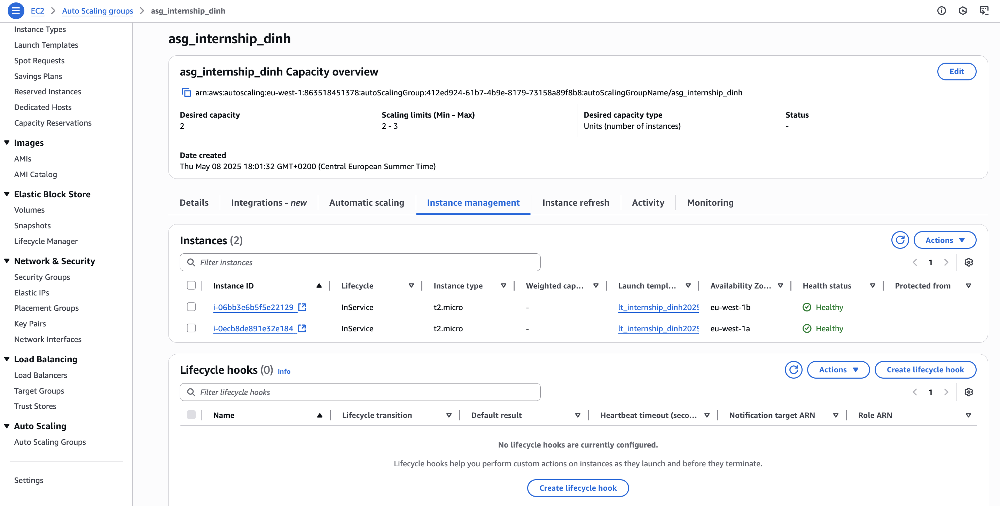
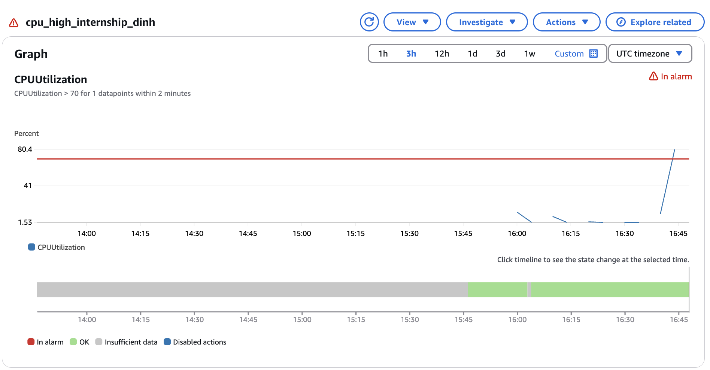
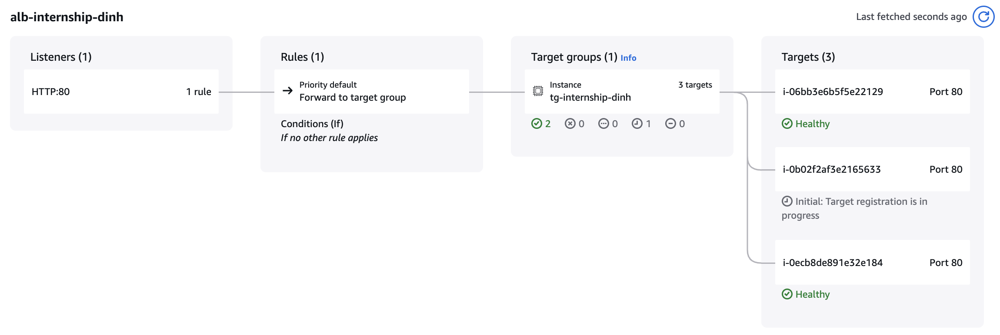
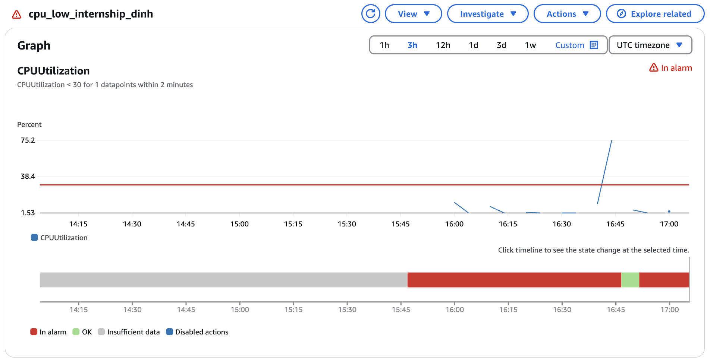
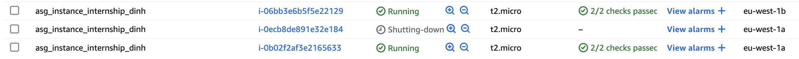

# 🚀 Trustsoft Internship - Terraform AWS Infrastructure

>  This branch consists of AWS infrastructure with implementation of **Auto Scaling Group**. 

---
## 📦 Project Structure

```plaintext
ts-internship/
├── assets/
│   └── trustsoft-internship-diagram.png  # Architecture diagram
├── infra-bootstrap/
│   └── backend_setup.tf            # Terraform remote state backend
│
├── .gitignore
├── alb.tf                          # Application Load Balancer config
├── auto-scaling.tf                 # Autoscaling group config
├── config_rules.tf               # Config rules for required tags
├── iam.tf                          # IAM roles and policies for EC2
├── outputs.tf                      # Terraform outputs
├── providers.tf                    # Provider & backend config
├── README.md
├── variables.tf                    # Input variables
├── vpc_flowlogs.tf               # VPC Flow Logs configuration
└── vpc_sg.tf                       # VPC, subnets, routing, SGs
```

---
## 🖼️ Architecture Diagram
<p align="center">
  
</p>

---

## 🌐 What Gets Created
- **VPC & Networking**:
  - VPC with public/private subnets across two Availability Zones
  - Internet Gateway (for public access) and NAT Gateway (for secure EC2 updates)

- **Security Groups**:
  - ALB allows HTTP from the internet
  - EC2 instances accept HTTP only from the ALB

- **Application Load Balancer (ALB)**:
  - Routes user traffic to EC2 instances in private subnets

- **Auto Scaling Group (ASG)**:
  - Automatically manages EC2 instances in private subnets based on CPU utilization
  - Scales out (adds instances) if CPU utilization exceeds 70% for 2 minutes
  - Scales in (removes instances) if CPU utilization drops below 30% for 2 minutes
  - Instances are created using a Launch Template, ensuring consistent configuration
    - IAM role and security group created in previous tasks are attached to ASG (later needed for stress test)
  - Integrated with an Application Load Balancer (ALB) for traffic distribution

- **VPC Flow Logs**:
  - Monitors and logs network traffic within the VPC.
  - Captures all traffic (accepted, rejected, and all types) for analysis.
  - Retention in days was set to 3 days
  - Logs are stored in a CloudWatch Log Group
  - Configured with an IAM Role with appropriate CloudWatch permissions.
  > Be aware that once **log group** is created, it won't be deleted via terraform destroy. For more information[`here`](https://github.com/hashicorp/terraform-provider-aws/issues/29247).

- **Config Rule - Required Tags**:
  - Enforces a tagging policy for EC2 instances using AWS Config.
  - The rule ensures that all EC2 instances have the following required tags:
    - **Name**: Descriptive name for the instance.
    - **Environment**: Specifies the environment (e.g., Dev, Test, Prod).
  - Automatically evaluates compliance for each EC2 instance in the VPC.
  - Non-compliant instances are flagged in AWS Config.

- **CloudWatch Monitoring**:
  - CPU alarms for both EC2 instances with SNS email notifications

- **Remote Terraform State**:
  - Stored securely in encrypted S3 with versioning
  - Uses DynamoDB table for state locking and consistency

---

## 🚀 How to Start This Branch

### Step 1: Initialize Terraform
```bash
terraform init
```

### Step 2: Validate Configuration
```bash
terraform validate
```

### Step 3: Plan the Infrastructure
```bash
terraform plan
```

### Step 4: Apply the Configuration
```bash
terraform apply -auto-approve
```

### Step 5: Import Existing VPC Flow Log Group (if already exists)
If the VPC Flow Log Group already exists, import it to avoid duplication:
```bash
terraform import aws_cloudwatch_log_group.log_group vpc_log_group_internship_dinh
```

### Step 6: Start a Session in Session Manager
- Go to the AWS Systems Manager Console.
- Navigate to "Session Manager".
- Start a new session with the EC2 instances created by the Auto Scaling Group.

### Step 7: Maximize CPU Usage for Testing
- For each EC2 instance, run the following command:
```bash
stress --cpu $(nproc) --timeout 300 &
```
- This will automatically detect the number of CPU cores and max them out for 5 minutes.
- The process will run in the background and you can check the cpu usage using `top`

### ✅ Result
- The Auto Scaling Group should automatically add new instances if the CPU exceeds the configured threshold.

---

## 1. Created Autoscaling Group
<p align="center">
  
</p>

## 2. Stress test exceeds CPU threshold
<p align="center">
  
</p>

## 3. New EC2 instance is created
<p align="center">
  
</p>

## 4. Stress is finished, EC2 instance shutdown
<p align="center">
  
  
</p>

---

## ✨ Author
- **Name:** Dinh Le Nguyen
- **Project:** Trustsoft Internship
- **Contact:** dnhlenguyen@gmail.com

---

## Requirements

| Name | Version |
|------|---------|
| <a name="requirement_terraform"></a> [terraform](#requirement\_terraform) | >= 1.3.0 |
| <a name="requirement_aws"></a> [aws](#requirement\_aws) | ~> 5.45 |

## Providers

| Name | Version |
|------|---------|
| <a name="provider_aws"></a> [aws](#provider\_aws) | 5.96.0 |

## Modules

No modules.

## Resources

| Name | Type |
|------|------|
| [aws_autoscaling_group.asg_internship_dinh](https://registry.terraform.io/providers/hashicorp/aws/latest/docs/resources/autoscaling_group) | resource |
| [aws_autoscaling_policy.scale_in_policy](https://registry.terraform.io/providers/hashicorp/aws/latest/docs/resources/autoscaling_policy) | resource |
| [aws_autoscaling_policy.scale_out_policy](https://registry.terraform.io/providers/hashicorp/aws/latest/docs/resources/autoscaling_policy) | resource |
| [aws_cloudwatch_log_group.log_group](https://registry.terraform.io/providers/hashicorp/aws/latest/docs/resources/cloudwatch_log_group) | resource |
| [aws_cloudwatch_metric_alarm.cpu_high](https://registry.terraform.io/providers/hashicorp/aws/latest/docs/resources/cloudwatch_metric_alarm) | resource |
| [aws_cloudwatch_metric_alarm.cpu_low](https://registry.terraform.io/providers/hashicorp/aws/latest/docs/resources/cloudwatch_metric_alarm) | resource |
| [aws_config_config_rule.required_tags](https://registry.terraform.io/providers/hashicorp/aws/latest/docs/resources/config_config_rule) | resource |
| [aws_eip.nat_eip](https://registry.terraform.io/providers/hashicorp/aws/latest/docs/resources/eip) | resource |
| [aws_flow_log.vpc_flow_logs](https://registry.terraform.io/providers/hashicorp/aws/latest/docs/resources/flow_log) | resource |
| [aws_iam_instance_profile.ssm_profile_internship_dinh](https://registry.terraform.io/providers/hashicorp/aws/latest/docs/resources/iam_instance_profile) | resource |
| [aws_iam_policy.flow_log_policy](https://registry.terraform.io/providers/hashicorp/aws/latest/docs/resources/iam_policy) | resource |
| [aws_iam_role.flow_log_role](https://registry.terraform.io/providers/hashicorp/aws/latest/docs/resources/iam_role) | resource |
| [aws_iam_role.ssm_s3_internship_dinh](https://registry.terraform.io/providers/hashicorp/aws/latest/docs/resources/iam_role) | resource |
| [aws_iam_role_policy_attachment.cloudwatch_agent_attach](https://registry.terraform.io/providers/hashicorp/aws/latest/docs/resources/iam_role_policy_attachment) | resource |
| [aws_iam_role_policy_attachment.flow_log_policy_attachment](https://registry.terraform.io/providers/hashicorp/aws/latest/docs/resources/iam_role_policy_attachment) | resource |
| [aws_iam_role_policy_attachment.ssm_attach_internship_dinh](https://registry.terraform.io/providers/hashicorp/aws/latest/docs/resources/iam_role_policy_attachment) | resource |
| [aws_iam_role_policy_attachment.ssm_s3_full_access](https://registry.terraform.io/providers/hashicorp/aws/latest/docs/resources/iam_role_policy_attachment) | resource |
| [aws_internet_gateway.igw_internship_dinh](https://registry.terraform.io/providers/hashicorp/aws/latest/docs/resources/internet_gateway) | resource |
| [aws_launch_template.lt_internship_dinh](https://registry.terraform.io/providers/hashicorp/aws/latest/docs/resources/launch_template) | resource |
| [aws_lb.alb_internship_dinh](https://registry.terraform.io/providers/hashicorp/aws/latest/docs/resources/lb) | resource |
| [aws_lb_listener.alb_listener_http](https://registry.terraform.io/providers/hashicorp/aws/latest/docs/resources/lb_listener) | resource |
| [aws_lb_target_group.tg_internship_dinh](https://registry.terraform.io/providers/hashicorp/aws/latest/docs/resources/lb_target_group) | resource |
| [aws_nat_gateway.nat_internship_dinh](https://registry.terraform.io/providers/hashicorp/aws/latest/docs/resources/nat_gateway) | resource |
| [aws_route.private_rt_default_route](https://registry.terraform.io/providers/hashicorp/aws/latest/docs/resources/route) | resource |
| [aws_route.public_rt_default_route](https://registry.terraform.io/providers/hashicorp/aws/latest/docs/resources/route) | resource |
| [aws_route_table.private_rt](https://registry.terraform.io/providers/hashicorp/aws/latest/docs/resources/route_table) | resource |
| [aws_route_table.public_rt](https://registry.terraform.io/providers/hashicorp/aws/latest/docs/resources/route_table) | resource |
| [aws_route_table_association.private_a](https://registry.terraform.io/providers/hashicorp/aws/latest/docs/resources/route_table_association) | resource |
| [aws_route_table_association.private_b](https://registry.terraform.io/providers/hashicorp/aws/latest/docs/resources/route_table_association) | resource |
| [aws_route_table_association.public_a](https://registry.terraform.io/providers/hashicorp/aws/latest/docs/resources/route_table_association) | resource |
| [aws_route_table_association.public_b](https://registry.terraform.io/providers/hashicorp/aws/latest/docs/resources/route_table_association) | resource |
| [aws_security_group.alb_internship_dinh](https://registry.terraform.io/providers/hashicorp/aws/latest/docs/resources/security_group) | resource |
| [aws_security_group.web_internship_dinh](https://registry.terraform.io/providers/hashicorp/aws/latest/docs/resources/security_group) | resource |
| [aws_subnet.private_subnet_a](https://registry.terraform.io/providers/hashicorp/aws/latest/docs/resources/subnet) | resource |
| [aws_subnet.private_subnet_b](https://registry.terraform.io/providers/hashicorp/aws/latest/docs/resources/subnet) | resource |
| [aws_subnet.public_subnet_a](https://registry.terraform.io/providers/hashicorp/aws/latest/docs/resources/subnet) | resource |
| [aws_subnet.public_subnet_b](https://registry.terraform.io/providers/hashicorp/aws/latest/docs/resources/subnet) | resource |
| [aws_vpc.vpc_internship_dinh](https://registry.terraform.io/providers/hashicorp/aws/latest/docs/resources/vpc) | resource |

## Inputs

| Name | Description | Type | Default | Required |
|------|-------------|------|---------|:--------:|
| <a name="input_ami_id"></a> [ami\_id](#input\_ami\_id) | AMI ID for EC2 instances | `string` | `"ami-0ce8c2b29fcc8a346"` | no |
| <a name="input_availability_zone_a"></a> [availability\_zone\_a](#input\_availability\_zone\_a) | Availability Zone for Subnet A | `string` | `"eu-west-1a"` | no |
| <a name="input_availability_zone_b"></a> [availability\_zone\_b](#input\_availability\_zone\_b) | Availability Zone for Subnet B | `string` | `"eu-west-1b"` | no |
| <a name="input_aws_region"></a> [aws\_region](#input\_aws\_region) | AWS Region to deploy into | `string` | `"eu-west-1"` | no |
| <a name="input_db_password"></a> [db\_password](#input\_db\_password) | ####################################### RDS settings ####################################### | `string` | n/a | yes |
| <a name="input_instance_type"></a> [instance\_type](#input\_instance\_type) | EC2 instance type | `string` | `"t2.micro"` | no |
| <a name="input_notification_emails"></a> [notification\_emails](#input\_notification\_emails) | List of email addresses to notify for CloudWatch alarms | `list(string)` | <pre>[<br/>  "lend03@vse.cz"<br/>]</pre> | no |
| <a name="input_private_subnet_cidr_a"></a> [private\_subnet\_cidr\_a](#input\_private\_subnet\_cidr\_a) | CIDR block for Private Subnet A | `string` | `"10.0.1.0/24"` | no |
| <a name="input_private_subnet_cidr_b"></a> [private\_subnet\_cidr\_b](#input\_private\_subnet\_cidr\_b) | CIDR block for Private Subnet B | `string` | `"10.0.2.0/24"` | no |
| <a name="input_public_subnet_cidr_a"></a> [public\_subnet\_cidr\_a](#input\_public\_subnet\_cidr\_a) | CIDR block for Public Subnet A | `string` | `"10.0.101.0/24"` | no |
| <a name="input_public_subnet_cidr_b"></a> [public\_subnet\_cidr\_b](#input\_public\_subnet\_cidr\_b) | CIDR block for Public Subnet B | `string` | `"10.0.102.0/24"` | no |
| <a name="input_user_data_script"></a> [user\_data\_script](#input\_user\_data\_script) | User data script to bootstrap EC2 instances | `string` | `"#!/bin/bash\nyum update -y\nsudo dnf install -y mariadb105\nyum install stress -y\nyum install -y nginx\nsystemctl start nginx\nsystemctl enable nginx\nINSTANCE_HOSTNAME=$(curl -s http://169.254.169.254/latest/meta-data/local-hostname)\necho \"<h1>Welcome to Server ACG - Internship Dinh</h1>\" > /usr/share/nginx/html/index.html\necho \"<h2>Instance Hostname: $INSTANCE_HOSTNAME</h2>\" >> /usr/share/nginx/html/index.html\n"` | no |
| <a name="input_user_data_script_a"></a> [user\_data\_script\_a](#input\_user\_data\_script\_a) | User data for EC2 Instance A | `string` | `"#!/bin/bash\nyum update -y\nsudo dnf install -y mariadb105\nyum install -y nginx\nsystemctl start nginx\nsystemctl enable nginx\necho \"<h1>Welcome to Server A - Internship Dinh</h1>\" > /usr/share/nginx/html/index.html\n"` | no |
| <a name="input_user_data_script_b"></a> [user\_data\_script\_b](#input\_user\_data\_script\_b) | User data for EC2 Instance B | `string` | `"#!/bin/bash\nyum update -y\nsudo dnf install -y mariadb105\nyum install -y nginx\nsystemctl start nginx\nsystemctl enable nginx\necho \"<h1>Welcome to Server B - Internship Dinh</h1>\" > /usr/share/nginx/html/index.html\n"` | no |
| <a name="input_vpc_cidr"></a> [vpc\_cidr](#input\_vpc\_cidr) | CIDR block for the VPC | `string` | `"10.0.0.0/16"` | no |

## Outputs

| Name | Description |
|------|-------------|
| <a name="output_alb_dns_name"></a> [alb\_dns\_name](#output\_alb\_dns\_name) | DNS name of the ALB |